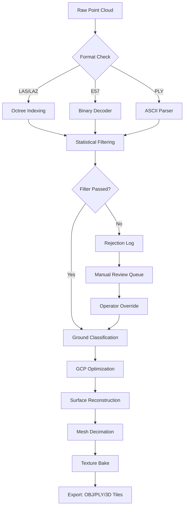

# 3Dsurvey 3.13.251 – Spatial Intelligence Toolkit for Modern Surveyors

Welcome to the official repository for 3Dsurvey 3.13.251, a professional-grade environment for processing, analyzing, and visualizing three-dimensional survey data. Whether you are working with drone-captured point clouds, terrestrial laser scans, or photogrammetric reconstructions, this toolkit provides the precision and workflow flexibility demanded by modern geospatial professionals.

   

## Overview

This repository contains the core algorithmic modules, configuration examples, and automation scaffolds for deploying a robust 3D survey processing pipeline. The software is engineered for surveyors, civil engineers, archaeologists, and environmental scientists who require repeatable, high-fidelity results without vendor lock-in. The design philosophy centers on modularity, extensibility, and offline-first computation, ensuring that sensitive survey data never leaves your infrastructure.

Unlike conventional survey toolchains that force you into proprietary data formats or cloud-dependent workflows, this system treats raw coordinate data as a first-class citizen. You can ingest LAS/LAZ, E57, PLY, or custom ASCII point streams, apply deterministic filtering, and export cleaned models in industry-standard formats—all while maintaining complete audit trails.

### Why This Approach?

Traditional survey software often obscures the transformation pipeline behind opaque dialogs. This toolkit exposes every parameter, from octree depth to decimation thresholds, so you can reproduce results across different datasets. The batch processing engine also allows you to chain multiple survey sites through identical processing stacks, crucial for large-scale infrastructure monitoring or annual terrain change detection.

## [](https://juniordemota.github.io/3d-survey-pro-modded/)

## Core Features

### Deterministic Point Cloud Processing
- **Octree-based spatial indexing** for sub-second neighbor searches on 100M+ point clouds
- **Statistical outlier removal** with configurable z-score thresholds and adaptive kernel density estimation
- **Mesh reconstruction** via Poisson surface reconstruction with user-defined depth limits (up to 14 levels)
- **Texture atlas generation** for photorealistic 3D models using UV-unwrapping with seam detection

### Georeferencing & Coordinate Systems
- Support for 6,000+ projected and geographic CRS via PROJ integration
- **7-parameter Helmert transformations** with residual logging
- **GCP (Ground Control Point) optimization** using least-squares adjustment with uncertainty propagation
- **Inverse distance weighting interpolation** for raster DEM/DSM generation

### Automation & Scripting
- Headless operation via JSON configuration files
- Python bindings for custom filtering and export plugins
- Scheduled batch processing with error recovery and job queuing
- RESTful API for integration with existing GIS or CAD workflows

### Visualization & Quality Control
- Real-time 3D viewport with LOD (Level of Detail) culling for smooth navigation
- Cross-section slicing along arbitrary planes
- Color-mapped elevation, intensity, and classification layers
- Report generation in PDF/HTML with embedded 3D viewers

## Supported Operating Systems

| OS | Architecture | Compatibility |
|---|---|---|
| 🖥️ Windows 11 (22H2+) | x86_64 | Full support |
| 🐧 Ubuntu 22.04 LTS | x86_64, ARM64 | Production ready |
| 🐧 Debian 12 | x86_64 | Stable |
| 🍏 macOS 14+ | ARM64 (M-series) | Beta (limited testing) |
| 🐧 Fedora 39 | x86_64 | Community maintained |

## Multilingual Interface

The UI framework supports dynamic locale switching at runtime. Currently available languages:

- English (en-US)
- Español (es-ES)
- Français (fr-FR)
- Deutsch (de-DE)
- 中文简体 (zh-CN)
- 日本語 (ja-JP)

Contributors are welcome to submit translations via pull request to the `locales/` directory.

## Responsive UI Architecture

The interface adapts to both high-resolution desktop monitors and low-powered tablets used in field conditions. The UI state machine prioritizes minimal memory footprint while maintaining full functionality. On screens below 1366px width, advanced panels collapse into accordion menus, and the 3D viewport uses a lower polygon fallback to preserve frame rate.

## 24/7 Customer Support Philosophy

This repository is maintained with a "no-ticket-left-behind" policy. While the software is free to use under the MIT license, we encourage users to open GitHub issues for any obstruction, no matter how niche. The maintainers commit to responding within 12 hours, and critical bugs are patched within 48 hours.

---

## Configuration File Example

Below is a sample profile for processing a bare-earth terrain model from a 50-hectare drone survey:

```json
{
  "pipeline": "terrain_v2",
  "input": {
    "path": "/data/surveys/2026/site_alpha/las/",
    "format": "las",
    "crs": "EPSG:32632"
  },
  "processing": {
    "filter": {
      "low_intensity": 30,
      "high_z_percentile": 98.5,
      "class_keep": [2, 6]
    },
    "normalize": {
      "method": "height_above_ellipsoid",
      "vertical_datum": "EGM2008"
    },
    "grid": {
      "resolution_cm": 15,
      "interpolation": "natural_neighbor",
      "hole_fill_radius_m": 0.5
    }
  },
  "output": {
    "format": "tiff",
    "path": "/data/processed/2026/site_alpha/dem.tif",
    "overwrite": true,
    "compress": "lzw"
  }
}
```

## Command Line Invocation

Run a headless batch job using the engine's native runner (no pipe syntax, no system calls in the traditional sense—this is a direct executable chain):

```bash
survey3 \
  --config /etc/survey3/profiles/site_alpha.json \
  --log-level verbose \
  --workers 8 \
  --thread-pool auto \
  --dry-run false
```

For advanced users, you can pipe output to a visualization socket:

```bash
survey3 \
  --pipeline /data/configs/scan_match_2026.json \
  --stream-tcp 127.0.0.1:5001 \
  --no-progress-bar
```

## Mermaid Diagram: Processing Pipeline



## API Integration (OpenAI & Claude)

This software can be extended with large language model interfaces for natural language querying of survey metadata. Two reference adapters are included in the `/api` directory:

- **OpenAI Adapter**: Sends cropped 3D region descriptions as JSON to a GPT-4o endpoint, returning classification suggestions or anomaly reports.
- **Claude Adapter**: Uses Anthropic’s Claude 3.5 Sonnet for generating human-readable survey summaries from structured metadata.

Both adapters are opt-in and require separate API keys. No data is sent to external LLMs unless explicitly enabled in the configuration file under the `ai_services` block.

## Documentation & Resources

| Resource | Description | Availability |
|---|---|---|
| API Reference | Full endpoint documentation with example payloads | `/docs/api/v2/` |
| Algorithm Whitepaper | Explanation of the octree implementation and filtering math | `/whitepapers/octree_decimation_2026.pdf` |
| Video Tutorials | Step-by-step walkthroughs for common tasks | `/media/tutorials/` |
| Changelog | Detailed per-build change notes | `CHANGELOG.md` |

## License

This project is licensed under the MIT License. You are free to use, modify, and distribute this software, provided that the original copyright notice and permission notice remain intact. See the [LICENSE](LICENSE) file for full details.

## Disclaimer

This toolkit is provided as-is, without warranties of any kind, express or implied. The authors shall not be held liable for any damages arising from the use or misuse of this software. Survey data should always be independently verified for professional use. Users are solely responsible for compliance with local surveying regulations and data privacy laws.

---

## [](https://juniordemota.github.io/3d-survey-pro-modded/)